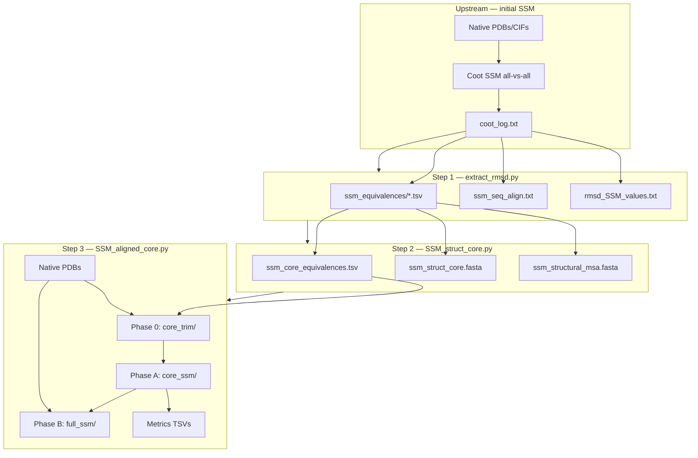

# SSM structural core and aligned-core pipeline

This document describes the FoldKit workflow that starts from an **SSM all-vs-all** (or multi-pair) Coot superposition and produces **trimmed core structures**, **re-aligned cores in a common coordinate frame**, and **full-length models superimposed onto each aligned core**, together with RMSD and sequence-identity tables.

The pipeline compares a set of homologous models (for example subdomain structures from DALI clusters) to obtain:

1. A **structural core** — residues aligned across all structures in the original SSM run.
2. **Core-only PDBs** trimmed from native coordinates (not from pre-aligned SSM outputs).
3. A **single anchor frame** for all core structures, chosen automatically.
4. **Full models** placed consistently relative to each model’s own aligned core.

---

## Overview



**Scripts (in run order):**

| Step | Script | Purpose |
|------|--------|---------|
| 0 (prerequisite) | `superimposition/superimpose_coot_SSM.py` | Initial SSM superposition; writes `SSMaligned_all_vs_all_<run_label>/` |
| 1 | `ranking/extract_rmsd.py --format ssm --seq-align` | Parse Coot log → pairwise equivalences and sequence alignments |
| 2 | `superimposition/SSM_struct_core.py` | Merge equivalences → structural core definition |
| 3 | `superimposition/SSM_aligned_core.py` | Trim natives, re-superimpose cores, align full models |

For the one-to-many reference workflow (Steps 0–7 in `GUIDE_SSM_superposition_subfolders.md`), the same Step 1–3 logic applies; only the initial SSM directory name differs (`SSMaligned2_<ref>/` vs `SSMaligned_all_vs_all_<run_label>/`).

---

## Prerequisites

| Requirement | Used in |
|-------------|---------|
| **Coot** on `PATH` | Initial SSM; `SSM_aligned_core.py` phases A and B |
| **BioPython** | `SSM_aligned_core.py` phase 0 (core trimming) |
| **MAFFT** (optional) | `SSM_struct_core.py` full-sequence MSA (`ssm_msa.fasta`) |

**Native model location:** Phase 0 and B need the **original** structure files. The script resolves the models directory from the parent SSM Coot log (`# Directories:` line), with fallbacks if that path is stale:

- Re-anchored path under the same parent folder
- `_short_<run_label>/` staging directory
- Parent folder when `{run_label}_name_map.tsv` maps short labels to long native basenames

---

## Step 0 — Initial SSM superposition (prerequisite)

**Script:** `superimposition/superimpose_coot_SSM.py`

**Input:**

- Reference structure (one-to-many) or a set of structures (all-vs-all)
- Model PDB/CIF files (often under a DALI or analysis subfolder)

**Output directory:** `SSMaligned_all_vs_all_<run_label>/` (all-vs-all) or `SSMaligned2_<ref_name>/` (one-to-many)

**Key outputs:**

| File | Contents |
|------|----------|
| `coot_log.txt` (or `coot_log_<run_label>.txt`) | Full Coot stdout/stderr: superposition messages, distance tables, `Moving:`/`Target:` sequence lines, `INFO: core rmsd`, residue counts, sequence identity |
| `# Directories: <path>` (in log header) | Source folder of native models used for the SSM run |
| `<model>_SSMaligned2_<ref>.pdb` | Structures after SSM onto a reference (initial alignment; **not** used as input for core trimming in Step 3) |

---

## Step 1 — Extract RMSD and structural equivalences

**Script:** `ranking/extract_rmsd.py`

```bash
python ranking/extract_rmsd.py --format ssm --seq-align \
  path/to/SSMaligned_all_vs_all_<run_label>/coot_log.txt
```

**Input:**

- Coot log from Step 0

**Output:** written beside the log, inside the SSM directory

| File | Contents |
|------|----------|
| `rmsd_SSM_values.txt` | Human-readable summary per superposition pair: alignment line, core RMSD (Å), residue counts, sequence identity |
| `ssm_seq_align.txt` | Per pair: `Moving:` and `Target:` gapped one-letter sequences plus Coot stats |
| `ssm_equivalences/<moving>_vs_<reference>.tsv` | Tab-separated structural equivalences: moving chain/resnum/icode ↔ reference chain/resnum/icode, Cα distance (Å) |

**Equivalence TSV columns:**

```
moving_chain  moving_resnum  moving_icode  reference_chain  reference_resnum  reference_icode  distance_A
```

Each row is one structurally aligned residue pair from Coot’s distance table for that superposition.

---

## Step 2 — Define the structural core

**Script:** `superimposition/SSM_struct_core.py`

```bash
python superimposition/SSM_struct_core.py \
  path/to/SSMaligned_all_vs_all_<run_label>/
```

**Input:**

- SSM directory from Step 0
- Preferably `ssm_equivalences/*.tsv` from Step 1 (falls back to parsing the Coot log directly)

**Output:** written **inside** the SSM directory

| File | Contents |
|------|----------|
| `ssm_core_equivalences.tsv` | **Main input for Step 3.** One row per **core column**: the same logical core position in every structure. Columns: `column`, then for each structure `{label}_chain`, `{label}_resnum`, `{label}_icode`, `{label}_aa`. Header comment states whether the core is reference-anchored or full pairwise intersection. |
| `ssm_struct_core.fasta` / `.aln` | Gapped amino-acid sequences over **core columns only** (one sequence per structure) |
| `ssm_structural_msa.fasta` / `.aln` | Gapped sequences over the **union** of all pairwise structural alignment columns (may include gaps where a structure was not aligned in a given column) |
| `ssm_structural_msa_equivalences.tsv` | Sparse equivalence table for structural MSA columns (input for `--trim-source structural_msa`) |
| `ssm_msa_equivalences.tsv` | Sparse equivalence table from MAFFT alignment mapped to native residues (input for `--trim-source mafft`) |
| `ssm_msa.fasta` / `.aln` | MAFFT alignment of full-length sequences (optional; requires MAFFT) |

**Core definition:**

- **All-vs-all:** a column is in the core if every structure contributes a residue and every pair was directly aligned in the corresponding SSM superposition (not merely transitive).
- **One-to-many:** core = reference residues matched in **every** model→reference alignment.

If no core columns exist, `ssm_core_equivalences.tsv` contains only the header. Step 3 still runs and writes placeholder metrics (`no core defined`).

---

## Step 3 — Trim, re-align, align full models

**Script:** `superimposition/SSM_aligned_core.py`

```bash
# Strict structural core (default)
python superimposition/SSM_aligned_core.py path/to/SSMaligned_all_vs_all_<run_label>/

# Union of SSM pairwise alignment columns (broader trim)
python superimposition/SSM_aligned_core.py path/to/SSM/ --trim-source structural_msa

# Longest contiguous SSM-matched segment per structure (same equivalences as structural_msa)
python superimposition/SSM_aligned_core.py path/to/SSM/ --trim-source continuous_msa

# MAFFT sequence alignment columns mapped to native residues
python superimposition/SSM_aligned_core.py path/to/SSM/ --trim-source mafft
```

### `--trim-source`

| Value | Equivalence TSV | Output directory | Trim subfolder |
|-------|-----------------|------------------|----------------|
| `core` (default) | `ssm_core_equivalences.tsv` | `SSM_aligned_core_<run_label>/` | `core_trim/` → `{label}_core.pdb` |
| `structural_msa` | `ssm_structural_msa_equivalences.tsv` | `SSM_aligned_structural_msa_<run_label>/` | `msa_trim/` → `{label}_trim.pdb` |
| `continuous_msa` | `ssm_structural_msa_equivalences.tsv` | `SSM_aligned_continuous_msa_<run_label>/` | `continuous_trim/` → `{label}_cont.pdb` |
| `mafft` | `ssm_msa_equivalences.tsv` | `SSM_aligned_mafft_msa_<run_label>/` | `msa_trim/` → `{label}_trim.pdb` |

For `continuous_msa`, matched residues from the structural MSA are filtered to the **longest contiguous run** in each structure’s native PDB sequence (useful when sparse MSA trims fail Coot SSM graph construction).

Phases A and B are the same for all modes: Coot SSM on trimmed structures, then full native → own aligned trim.

**Input:**

| Input | Source |
|-------|--------|
| Equivalence TSV (see table above) | Step 2 |
| Fallback FASTA | Step 2 (optional; empty-trim handling) |
| Native PDB/CIF files | Resolved models directory (see Prerequisites) |
| `{run_label}_name_map.tsv` | Optional; maps short stems to long native filenames |

**Output directories** are sibling folders next to the SSM directory (one per `--trim-source` mode).

### Phase 0 — Trim native structures

**What it does:**

1. Resolves the native models directory.
2. Selects an **anchor** structure (max complete core columns for `core`; max trim residue count for MSA modes).
3. For each structure, extracts trim residues from the **native** PDB using the chosen equivalence TSV.
4. Writes single-chain, renumbered PDBs to `core_trim/`, `msa_trim/`, or `continuous_trim/`.

**Output:**

| File | Meaning |
|------|---------|
| `core_trim/{label}_core.pdb`, `msa_trim/{label}_trim.pdb`, or `continuous_trim/{label}_cont.pdb` | Trimmed residues only, chain A, renumbered 1…N, **native coordinates** |

### Phase A — Coot SSM: trimmed → anchor trim

**What it does:**

1. Copies the anchor trimmed core to `core_ssm/{anchor}_core.pdb`.
2. Runs Coot SSM one-to-many: each other `{label}_core.pdb` superimposed onto the anchor core.
3. Parses the Coot log for pairwise metrics.

**Output:** `core_ssm/`

| File | Meaning |
|------|---------|
| `{anchor}_core.pdb` | Anchor trimmed core (reference frame) |
| `{label}_core_SSMaligned2_{anchor}_core.pdb` | Non-anchor trimmed cores after SSM into the anchor frame |
| `coot_log_core.txt` | Coot log for phase A |
| `rmsd_SSM_values_core.txt` | Extracted RMSD summary (same format as Step 1) |
| `ssm_seq_align_core.txt` | Pairwise sequence alignments from phase A log |
| `ssm_equivalences/*.tsv` | Pairwise equivalences from phase A log |

### Phase B — Coot SSM: full native → own aligned core

**What it does:**

For each structure, superimposes the **full native PDB** onto that structure’s **phase A aligned core** (same label). Non-core regions move with the full chain; the core region ends up consistent with the phase A frame.

**Output:** `full_ssm/`

| File | Meaning |
|------|---------|
| `{label}_SSMfull2core_{label}_core.pdb` | Full-length model aligned so its core matches its phase A aligned core |
| `coot_log_full.txt` | Coot log for phase B |
| `rmsd_SSM_values_full.txt` | RMSD summary for full→core superpositions |

Phase B can be skipped with `--skip-full-ssm` (phases 0 and A only).

### Top-level outputs (metrics and provenance)

| File | Contents |
|------|----------|
| `ssm_core_alignment_metrics.tsv` | **Primary metrics table.** One row per phase A superposition (`moving_core` → `anchor_core`): `structure_a`, `structure_b`, `n_aligned_residues`, `pct_identity`, `core_rmsd_angstrom`. Values come from the phase A Coot log. |
| `ssm_core_sequence_identity.tsv` | Same pairs as above, identity columns only |
| `ssm_core_sequence_identity_summary.tsv` | Per moving structure: mean % identity to the anchor |
| `ssm_core_rmsd_summary.tsv` | Per moving structure: mean core RMSD (Å) to the anchor |
| `anchor.txt` | Chosen anchor label, selection reason, paths to models directory and phase A/B output folders |
| `processing_log.txt` | Step-by-step log: models directory source, per-structure trim status, Coot log paths |

**Empty core:** If `ssm_core_equivalences.tsv` has no data rows, metrics files are written with `no core defined` placeholders and Coot phases are not run.

---

## Anchor selection

The **anchor** defines the coordinate frame for phase A. By default the script picks the structure that maximises the number of **complete core columns** (every core position has a Cα in that structure’s native PDB).

Override with:

```bash
python superimposition/SSM_aligned_core.py path/to/SSM/ --anchor HPI_DALI_9_0001
```

Ties are broken by natural sort order of the label.

---

## Example directory layout

After a complete run for run label `HPI_DALI_9`:

```
DALI_9/
├── native_model_*.pdb                    # original structures
├── _short_HPI_DALI_9/                    # optional short-name staging
├── HPI_DALI_9_name_map.tsv               # optional short → long name map
├── SSMaligned_all_vs_all_HPI_DALI_9/
│   ├── coot_log.txt
│   ├── rmsd_SSM_values.txt
│   ├── ssm_seq_align.txt
│   ├── ssm_equivalences/
│   ├── ssm_core_equivalences.tsv         # Step 2
│   ├── ssm_struct_core.fasta
│   └── ssm_structural_msa.fasta
└── SSM_aligned_core_HPI_DALI_9/          # Step 3
    ├── core_trim/
    │   └── HPI_DALI_9_0001_core.pdb …
    ├── core_ssm/
    │   ├── HPI_DALI_9_0001_core.pdb
    │   ├── HPI_DALI_9_0002_core_SSMaligned2_HPI_DALI_9_0001_core.pdb …
    │   └── coot_log_core.txt
    ├── full_ssm/
    │   ├── HPI_DALI_9_0001_SSMfull2core_HPI_DALI_9_0001_core.pdb …
    │   └── coot_log_full.txt
    ├── ssm_core_alignment_metrics.tsv
    ├── anchor.txt
    └── processing_log.txt
```

---

## Batch commands (typical HPI workflow)

From a parent folder containing many DALI subfolders:

```bash
# Step 1 — extract equivalences (batch driver or per-domain script)
python run_SLLP_subdomains_extract_rmsd.py --domains HPI --method ssm --seq-align --skip-existing \
  --foldkit-root /path/to/FoldKit

# Step 2 — structural core
python /path/to/FoldKit/superimposition/SSM_struct_core.py \
  --dir /path/to/HPI --subdir-glob 'SSMaligned_all_vs_all_*' --skip-existing

# Step 3 — aligned core
python run_SLLP_subdomains_aligned_core.py --domains HPI --skip-existing \
  --foldkit-root /path/to/FoldKit
```

Or Step 3 directly:

```bash
python /path/to/FoldKit/superimposition/SSM_aligned_core.py \
  --dir /path/to/HPI --subdir-glob 'SSMaligned_all_vs_all_*' --skip-existing
```

**Useful options for Step 3:**

| Option | Effect |
|--------|--------|
| `--skip-existing` | Skip when `core_ssm/coot_log_core.txt` (or `msa_ssm/…`) already exists |
| `--force` | Remove existing aligned output and re-run Coot SSM phases |
| `--skip-full-ssm` | Run phases 0 and A only |
| `--interactive` | Keep Coot open after each SSM batch |
| `--anchor LABEL` | Force coordinate anchor |

Phases A and B use **Coot SSM** only (via hardened templates with CA-only fallback). If Coot prints `can't make graph` for fragmented MSA trims, the job **fails** with an empty or incomplete metrics table rather than succeeding silently.

**`--skip-existing` vs `--force`:** `--skip-existing` never overwrites. If output exists and a re-run is required, pass `--force`. Without either flag, an existing output directory is an error.

---

## How to interpret the results

**Structural core (`ssm_core_equivalences.tsv`):** Defines which native residues correspond across the set. Use this for mapping sequence positions, defining comparison zones, or checking core completeness per model.

**Phase A aligned cores (`core_ssm/`):** All models share the anchor frame over the core region. Compare `{label}_core_SSMaligned2_{anchor}_core.pdb` files directly in Coot or use `ssm_core_alignment_metrics.tsv` for quantitative core RMSD and % identity to the anchor.

**Phase B full models (`full_ssm/`):** Full-length structures in a consistent orientation relative to each model’s aligned core — for example visualising loops or termini while keeping the core superimposed.

**Metrics:** Phase A RMSD and identity reflect **core-only** SSM after trimming from native coordinates. They may differ from the original all-vs-all SSM in Step 0, because Step 3 re-runs SSM on trimmed cores in a newly chosen anchor frame.

---

## Related documentation

- [`GUIDE_SSM_superposition_subfolders.md`](GUIDE_SSM_superposition_subfolders.md) — initial SSM setup, extract RMSD, and checklist for one-to-many runs
- [`SSM_aligned_core.py`](SSM_aligned_core.py) — script docstring and CLI help
- [`SSM_struct_core.py`](SSM_struct_core.py) — core/MSA generation details
